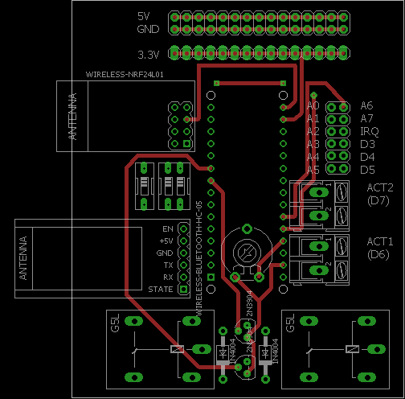
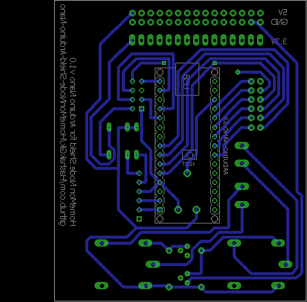

HomeMon Node Shield for Arduino Nano
====================================

This Eagle layout can be used to etch a single HomeMon node, in the form of a shield for the Arduino Nano prototyping platform.

 

 

Features
--------

- Eleven pins can be used as general I/O (e.g. for reading data from sensors)
- Two actuators can be driven by relays
- A power supply bus (5V, 3.3V and ground lines) with fifteen pins is added for convenience
- An [NRF24L01+ 2.4 GHz transceiver](https://www.nordicsemi.com/Products/Low-power-short-range-wireless/nRF24-series) is used for inter-node communication, and serial communication (either via the USB converter of the Arduino or, **optionally**, via an [HC-05 based Bluetooth adapter](https://cdn.makezine.com/uploads/2014/03/hc_hc-05-user-instructions-bluetooth.pdf) allows the node to be connected to a desktop sink running the [HomeMon Viewer Application](https://github.com/HashakGik/HomeMon-MFC-Cpp)
- A trimmer can be used to set the analog voltage reference
- Both the 2.4 GHz transceiver and the optional Bluetooth adapter can be turned on/off by switches (the Bluetooth adapter can additionally be put into AT mode for configuration purposes).

Pinout
------

- Serial pins (`D0` and `D1`): Bluetooth adapter
- SPI pins (`D11` to `D13`), `D2`, `D8` and `D9` pins: radio transceiver
- Analog pins (`A0` to `A7`): directly connected to the `SENSORS` connector
- Digital pins `D2` to `D5`: directly connected to the `SENSORS` connector. (Important note: pin `D2` is also connected to the `IRQ` pin of the transceiver)
- Digital pins `D6` and `D7`: connected to the actuator connectors (`ACT1` and `ACT2` respectively) through two relays
- `AREF`: connected to the analog reference trimmer
- `GND`, `3V3` and `5V`: connected to the power supply connectors
- `RST`, `VIN` and `D10`: unconnected.

Bill of materials
-----------------

- 1x 10k linear trimmer
- 1x Arduino Nano
- 2x Diodes with DO-41 package (e.g. 1N4004)
- 1x DIP switch SPST 1 position (RS-Components code: 877-2100)
- 1x DIP switch SPST 2 positions (RS-Components code: 877-2113)
- 1x HC-05 Bluetooth module (6 pins breakout board)
- 2x Monostable 5V DC G5LE relays (RS-Components code: 808-8465)
- 2x NPN transistors with TO-92 package (e.g. 2N3904)
- 1x NRF24L01+ module (8 pins breakout board)
- 2x Two-ways PCB terminal blocks with 2.54mm pitch (RS-Components code: 790-1098)

Remarks
-------

- The shield relies on the Arduino for power supply (i.e. it doesn't have batteries nor a DC connector, energy must be supplied from the USB connector or the `VIN` pin)
- Arduino pin `D10 (SS)` is left unconnected because the SPI library may malfunction if the pin is set to high when the Arduino is acting as SPI master
- The additional components are defined in the freely available [DIYmodules.org component library](https://www.diymodules.org).